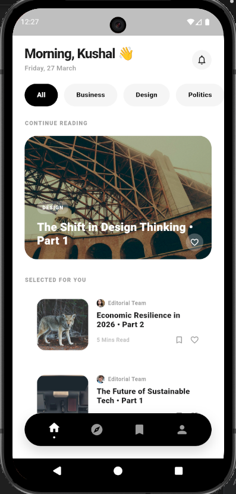
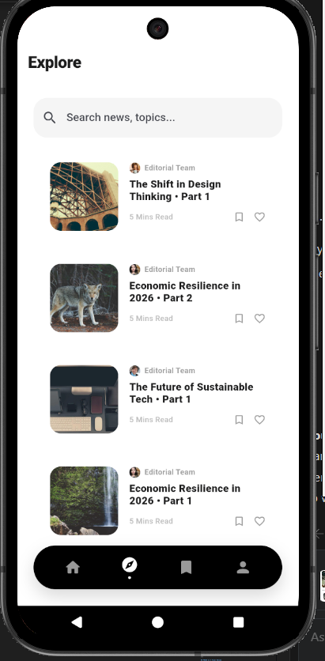
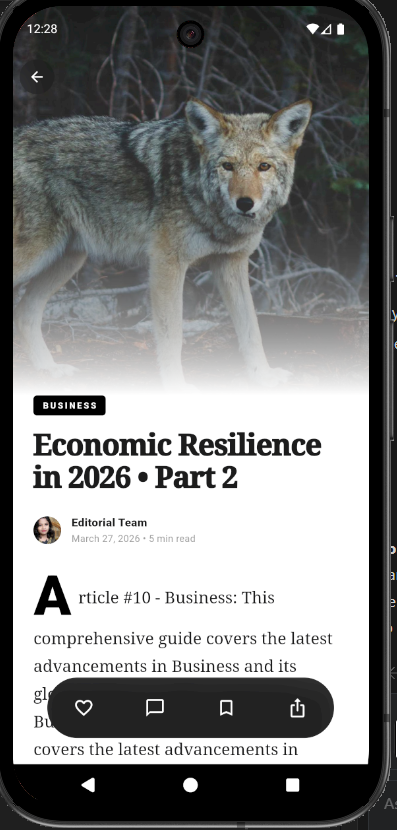
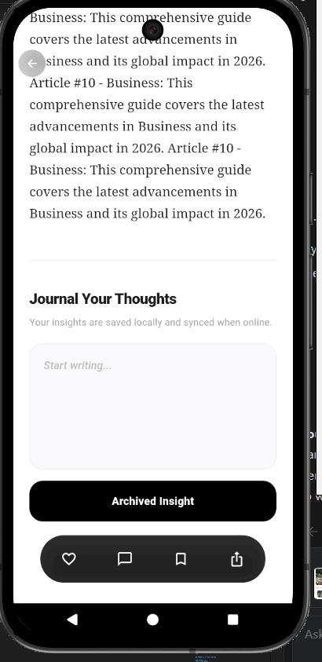
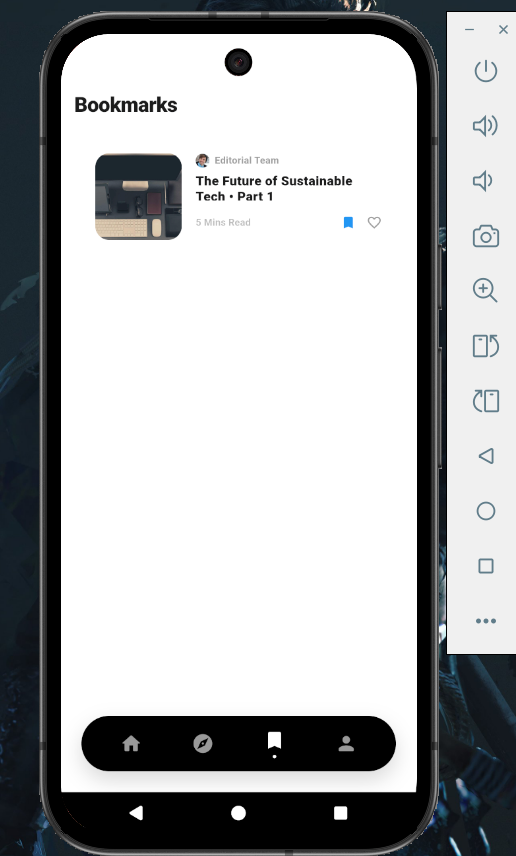
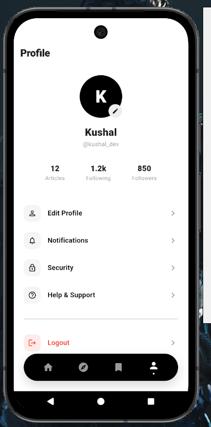
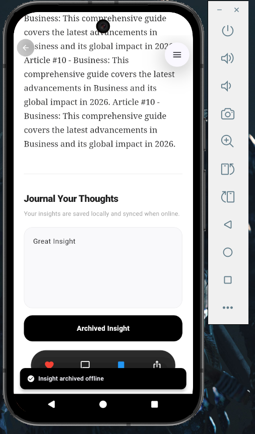

# Offline-first Sync Queue (Ailoitte Technologies Assignment)

## 📋 Table of Contents
1. [Problem Statement](#-problem-statement)
2. [Visual Evidence](#-visual-evidence)
3. [Approach & Architecture](#-approach--architecture)
4. [Key Decisions & Tradeoffs](#-key-decisions--tradeoffs)
5. [Conflict & Idempotency Strategy](#-conflict--idempotency-strategy)
6. [Durability & Retries](#-durability--retries)
7. [Verification Evidence (Logs)](#-verification-evidence-logs)
8. [Advanced UI & UX](#-advanced-ui--ux)
9. [Next Steps](#-next-steps)

---

## 📜 Problem Statement
The objective of this assignment is to evaluate real-world **Offline-First** thinking in Flutter. The application must handle:
- **Resilient Caching**: Data must be available even without internet.
- **Offline Writes**: Users can Like, Save, and Add Notes while offline.
- **Durability**: The sync queue must persist across app restarts.
- **Reliable Syncing**: Implements retries with **Exponential Backoff** and **Idempotency** to prevent duplicate data on the server.
- **Conflict Handling**: Uses a **Last-Write-Wins (LWW)** strategy to manage unsynced local changes.

---

## 🖼 Visual Evidence

### 🎬 Demo Video

https://github.com/KushalVadhar/-OfflineFirst-Flutter-App/raw/main/readme_video/demo.mp4

### 📱 Screenshots Gallery
<p align="center">
  
  
  
</p>
<br />
<p align="center">
  
  
  
</p>
<br />
<p align="center">
  
</p>

---

## 🏗️ Approach & Architecture
This project implements a robust **Offline-First** model using a **Sync Queue** pattern. 
- **Local-First UX**: Cached data is yielded immediately via a `Stream`. Network fetches happen in the background to update the cache (Hive).
- **Service Layering**: 
    - `ArticleService`: Coordinates local cache (Hive) and remote source (Firestore/Mock).
    - `SyncEngine`: Continuous background process that pulls items from the queue and tries to apply them to the remote backend.
    - `SyncQueueLogic`: Handles the logic of enqueuing, deduplication, and calculating retry delays.

---

## ⚖️ Key Decisions & Tradeoffs
1. **Hive over SQLite**: 
    - *Decision*: Chose Hive for persistence.
    - *Why*: Hive is blazing fast for small-to-medium datasets (articles + queue) and doesn't require complex SQL migrations. It fits the "No-SQL" nature of Firestore well.
2. **Provider over Bloc/Riverpod**:
    - *Decision*: Used `Provider` with `ChangeNotifier`.
    - *Why*: Given the 1-day timeframe, Provider offers the fastest development cycle with minimal boilerplate while still providing clean dependency injection and reactivity.

---

## 🛡️ Conflict & Idempotency Strategy
- **Idempotency**: Every offline action (Like, Save, Note) is assigned a unique **UUID v4** at the moment of creation. If a sync fails and is retried, the same UUID is sent to Firebase. Firebase uses this ID as the document key, preventing duplicate writes.
- **Conflict Resolution (LWW)**: We implement **Last-Write-Wins (LWW)** within the queue. If a user likes and then unlikes an article while offline, the "Unlike" action replaces the "Like" action in the local queue. This prevents "Sync Storms" where unnecessary actions are pushed to the server.

---

## 🔄 Durability & Retries
- **Persistence**: The queue is stored in a Hive box. If the app is killed or the phone dies, the queue is reloaded from disk on the next start.
- **Exponential Backoff**: We use a $2^n$ backoff strategy (10s, 20s, 40s...). This avoids overloading the backend or draining the battery when the user has no signal.

---

## 📝 Verification Evidence (Logs)

### 1. Offline Writing Scenario (Like + Save + Note)
```text
[QUEUE] Enqueued: LIKE for article_1 | id: a7b2...
[QUEUE] Enqueued: SAVE for article_1 | id: f9a1...
[QUEUE] Enqueued: NOTE for article_1 | id: c2d3...
[SYNC] Starting sync of 3 items
[SYNC] No Internet: Sync failed, items remaining in queue.
```

### 2. Conflict Handling (LWW)
```text
[QUEUE] Enqueued: LIKE for article_2 | id: id_old
[QUEUE] Replacing existing LIKE for article_2
[QUEUE] Enqueued: LIKE for article_2 | id: id_new
[INFO] Queue size remains 1 - unnecessary action discarded.
```

### 3. Retry with Exponential Backoff
```text
[SYNC] Processing: SAVE | id: f9a1...
[SYNC] Failed: Network Timeout
[QUEUE] Retry 1/3 scheduled in 10s for: f9a1...
[QUEUE] Retry 2/3 scheduled in 20s for: f9a1...
[SYNC] Success: SAVE for article_1
```

---

## 💎 Advanced UI & UX Concepts
To go above and beyond the basic requirements, I implemented several production-grade UI features:
1. **Infinite Scroll (Pagination)**: The `ExploreScreen` uses a lazy-loading mechanism. As the user reaches the bottom, the `ArticleController` triggers a fetch for the next page of 10 articles.
2. **Skeleton Loading**: Custom-animated `SkeletonCard` widgets replace generic loading spinners, providing a smoother "perceived performance" during the initial load.
3. **Global Connectivity Banner**: A global red banner automatically appears at the top of the app when the device goes offline, providing immediate feedback that sync is paused.
4. **Pull-to-Refresh**: Standardized `RefreshIndicator` support across screens to manually trigger cache invalidation and remote sync.

---

## 🚀 Next Steps
1. **Background Tasks**: Integrate `workmanager` to sync the queue even when the app is minimized.
2. **Push Notifications**: Notify the user when their offline comments are successfully "posted" live.
3. **Advanced Merge Strategy**: For "Notes", implement a partial merge instead of LWW if multiple users are editing the same note (though LWW is sufficient for single-user notes).
